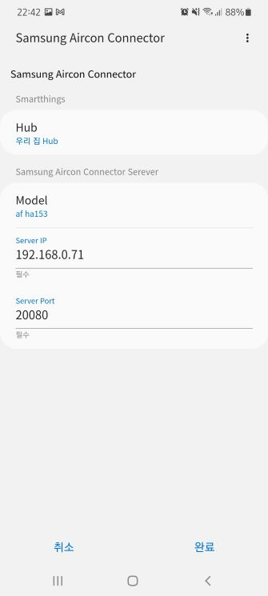
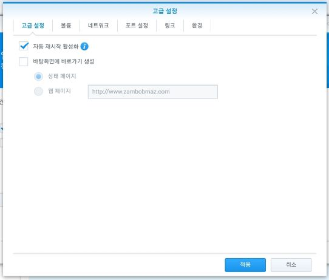

# Samsung Aircon Connector - SmartThings
This app creates a virtual device in SmartThings.

## Limitation
The air conditioner does not broadcast own status so there is no way to get the air conditioner status change.  

Instead, this DTH polls the state every miniute. Therefore, if you directly operate the air conditioner rather than SmartThings, it may take up to 1 minute for the status to be applied.

## Pre Requirement
### Samsung Air conditioner Connector - RESTApi Server
It needs server side app. See below "Samsung Air conditioner Connector - RESTApi Server" section

## Install
### Add Repository
SmartThings Groovy IDE site https://graph.api.smartthings.com/  
Add github repo to both "My SmartApps" and "My Device Handlers"  
- add owner : obmaz / name : samsung_airconnector / branch : master  
  


### Publish SmartApp and DTH
Publish DTH : devicetypes/imageafter45121/af-ha153.src/af-ha153.groovy  
Publish SmartApp : smartapps/imageafter45121/samsung-aricon-connector.src/samsung-aricon-connector.groovy

## Run Smartapp
Add and Run SmartApp in your device  
It will make virtual device based on DTH and SmartApp  

* SmartApp Screen



* Device UI Screen


# Samsung Air conditioner Connector - RESTApi Server
This app provides RESTFul APIs to control legacy Samsung air conditioner using socket connection with 2878 port.  

## Limitation
The air conditioner MCU is not good, so it sometimes could not return updated status due to MCU error or processing delay. 

## Dev Enviroment
* Model : AF-HA153WRG (Korea)
* Language : GoLang 1.16
* Test : Ubuntu 20.04 Lts

## Pre Requirement
### Network Connection
The air conditioner should be connected to router (Use Official App)  
Note that the korea model does not need cert.

## Install
### Build & Run
Note that the golang should be installed if you want build.

```bash
$ git clone https://github.com/obmaz/samsung_aircon_connector.git
$ cd samsung_aircon_connector/server
$ go build
$ ./samsung_aircon_connector
```

### Docker
* Docker Hub : https://hub.docker.com/r/bobmaz99/samsung_aircon_connector/tags
* obmaz99/samsung_aircon_connector

#### Docker CLI
Note that you do not need to clone git or pull the docker image. docker pulls the image from docker hub when docker run.  
Modify the -v option to match your host directory path

```bash
$ sudo docker run -d --restart always -p 20080:20080 --name samsung_aircon_connector -v /your/host/directory/config:/config:cached obmaz99/samsung_aircon_connector
```

#### Docker Compose
Note that it requires docker-compose.yml file.  
Use git clone or copy and paste the file.  
Modify the volume in yml file to match your host directory path

```bash
$ sudo docker-compose up -d
```

#### Docker Synology
Note that you need to pull the docker image in Synology docker app.

* Check Permission  
  

* Check Auto Restart  
  

* Map the /config directory to external  
  

* Check Host Network (Optional)  
  

## Config
To communicate between air conditioner and server, you should set some value to config.  
The config file is located in "/config/config.yaml"

```yaml
ServerPort : {Your server port}
AirconIP : {Your air conditioner IP}
AirconPort : {Your ari conditioner port (2878 in case of af-ha158)}
Token : {Unique id from the aircon (Use GetToken API or Openssl)}
DUID : {Aircon WiFi_MAC_ADDRESS}
```
* Sample confing
```yaml
ServerPort : 20080
AirconIP : 192.168.0.188
AirconPort : 2878
Token : ea89ff86-xxxx-xxxx-a9e6-705b3a3d1756
DUID : 30144A125XXX
```

## How to Get Token
Before use API, the token should be set enviroment.  
The Token is only brodacast one time when the aircon is turned on.  
So call GetToken API first(or use Openssl) and then turn on the aircon.

## API
These APIs designed for ease-use on browser URL.  
Therefore, all APIs are "GET" method even though some APIs are "Create and Update"  
It only has two http status code: 200 Ok and 400 Bad Request.

### Request
#### Server Health Check
* End Point
```
/get/ping
```

#### Set Config via API (Not Imple.)
* End Point
```
/config/airconip/{value}
/config/duid/{value}
/config/token/{value}
```

* Sample Request
```
/config/airconip/192.168.0.188
/config/duid/30144A125XXX
/config/token/ea89ff86-xxxx-xxxx-a9e6-705b3a3d1756
```

#### Reset Connection
It closes the connection between server and Aircon (Conn.close() and Conn = nil).  
Please use it if connection problem happens.

* End Point
```
/config/close
```

* Response Sample
```json
{
    "timestamp": "Wed, 05 Aug 2020 13:06:59 +0000",
    "command": "Token",
    "status": "Success"
}
```

#### Token
* End Point
```
/get/token
```

* Response Sample
```json
{
    "timestamp": "Wed, 05 Aug 2020 13:06:59 +0000",
    "command": "Token",
    "status": "Success",
    "data": {
        "token": "ea89ff86-xxxx-xxxx-a9e6-705b3a3d1756"
    }
}
```

#### Control
* End Point
```
/contorl/{command}/{value}
```

* Request Sample
```
/control/AC_FUN_POWER/On
```

* Response Sample
```json
{
  "timestamp": "Wed, 05 Aug 2020 17:29:18 +0900",
  "command": "AC_FUN_POWER",
  "status": "Success",
  "data": {
    "type": "DeviceControl",
    "status": "Okay",
    "duid": "30144A125FDC",
    "commandId": "cmd1"
  }
}
```

* Command List (AH-HA153KR)  
You can find more detail in type attribute of "devicestate" response  
  
```
*case sensitive
AC_FUN_COMODE/Off
AC_FUN_COMODE/Quiet // Silent Mode
AC_FUN_COMODE/Smart // Smart Sensor Mode based on Camera 
AC_FUN_COMODE/Speed // Temporary Speed up
AC_FUN_DIRECTION/Off
AC_FUN_DIRECTION/Center
AC_FUN_DIRECTION/Wide
AC_FUN_DIRECTION/Long
AC_FUN_DIRECTION/Left
AC_FUN_DIRECTION/Right
AC_FUN_OPERATION/Family
AC_FUN_OPERATION/Solo
AC_FUN_OPMODE/Auto
AC_FUN_OPMODE/Wind
AC_FUN_OPMODE/Cool
AC_FUN_OPMODE/Dry
AC_FUN_OPMODE/DryClean
AC_FUN_OPMODE/CoolClean
AC_FUN_POWER/Off
AC_FUN_POWER/On
AC_FUN_POWER/Toggle
AC_FUN_TEMPSET/{number}
AC_FUN_TEMPSET/Up
AC_FUN_TEMPSET/Down
AC_FUN_WINDLEVEL/Auto
AC_FUN_WINDLEVEL/Mid
AC_FUN_WINDLEVEL/High
AC_FUN_WINDLEVEL/Turbo

AC_ADD_AUTOCLEAN/On
AC_ADD_AUTOCLEAN/Off
AC_ADD_SMARTON/Off // Lock off to use Official App
AC_ADD_SMARTON/On  // Lock on to useOfficial App
AC_ADD_VOLUME/Mute
AC_ADD_VOLUME/33
AC_ADD_VOLUME/66
AC_ADD_VOLUME/100
```

#### Device State
* End Point
```
/get/devicestate
```

* Response 
```json
{
  "timestamp": "Wed, 05 Aug 2020 17:28:03 +0900",
  "command": "Devicestate",
  "status": "Success",
  "data": {
    "type": "DeviceState",
    "status": "Okay",
    "deviceState": {
      "device": {
        "duid": "30144A125XXX",
        "groupId": "AC",
        "modelId": "AC",
        "attr": [
          {
            "id": "AC_FUN_ENABLE",
            "type": "RW",
            "value": "Enable"
          },
          {
            "id": "AC_FUN_POWER",
            "type": "RW",
            "value": "On"
          },
          {
            "id": "AC_FUN_OPERATION",
            "type": "RW",
            "value": "Family"
          },
          {
            "id": "AC_FUN_OPMODE",
            "type": "RW",
            "value": "Dry"
          },
          {
            "id": "AC_FUN_COMODE",
            "type": "RW",
            "value": "Off"
          },
          {
            "id": "AC_FUN_WINDLEVEL",
            "type": "RW",
            "value": "Auto"
          },
          {
            "id": "AC_FUN_DIRECTION",
            "type": "RW",
            "value": "Off"
          },
          {
            "id": "AC_FUN_TEMPSET",
            "type": "RW",
            "value": "25"
          },
          {
            "id": "AC_FUN_TEMPNOW",
            "type": "R",
            "value": "26"
          },
          {
            "id": "AC_FUN_ONTIMER",
            "type": "RW",
            "value": "0"
          },
          {
            "id": "AC_FUN_OFFTIMER",
            "type": "RW",
            "value": "0"
          },
          {
            "id": "AC_FUN_SLEEP",
            "type": "RW",
            "value": "0"
          },
          {
            "id": "AC_FUN_ERROR",
            "type": "R",
            "value": "00000000"
          },
          {
            "id": "AC_ADD_AUTOCLEAN",
            "type": "RW",
            "value": "Off"
          },
          {
            "id": "AC_ADD_STERILIZE",
            "type": "RW",
            "value": "Off"
          },
          {
            "id": "AC_ADD_HUMIDI",
            "type": "RW",
            "value": "Off"
          },
          {
            "id": "AC_ADD_PANEL",
            "type": "RW",
            "value": "Close"
          },
          {
            "id": "AC_ADD_LIGHT",
            "type": "RW",
            "value": "On"
          },
          {
            "id": "AC_ADD_SMARTON",
            "type": "RW",
            "value": "Off"
          },
          {
            "id": "AC_ADD_WEATHER",
            "type": "W",
            "value": "35"
          },
          {
            "id": "AC_ADD_VOLUME",
            "type": "RW",
            "value": "Mute"
          },
          {
            "id": "AC_ADD_SETKWH",
            "type": "RW",
            "value": "0"
          },
          {
            "id": "AC_ADD_STOP_WIFI",
            "type": "W",
            "value": "0"
          },
          {
            "id": "AC_ADD2_MACHIGH",
            "type": "W",
            "value": "4608"
          },
          {
            "id": "AC_ADD2_MACMID",
            "type": "W",
            "value": "24320"
          },
          {
            "id": "AC_ADD2_MACLOW",
            "type": "W",
            "value": "56320"
          },
          {
            "id": "AC_ADD2_USEDWATT",
            "type": "R",
            "value": "1"
          },
          {
            "id": "AC_ADD2_WIFI",
            "type": "w",
            "value": "Connected"
          },
          {
            "id": "AC_ADD2_INTERNET",
            "type": "w",
            "value": "Connected"
          },
          {
            "id": "AC_TODAY_TEMP",
            "type": "W",
            "value": "0"
          },
          {
            "id": "AC_TODAY_PREC",
            "type": "W",
            "value": "0"
          },
          {
            "id": "AC_TODAY_WEATHER",
            "type": "W",
            "value": "0"
          },
          {
            "id": "AC_NOW_HUM",
            "type": "W",
            "value": "0"
          },
          {
            "id": "AC_NOW_SANDY",
            "type": "W",
            "value": "0"
          },
          {
            "id": "AC_TOMO_MIN",
            "type": "W",
            "value": "0"
          },
          {
            "id": "AC_TOMO_MAX",
            "type": "W",
            "value": "0"
          },
          {
            "id": "AC_TOMO_PREC",
            "type": "W",
            "value": "0"
          },
          {
            "id": "AC_TOMO_WEATHER",
            "type": "W",
            "value": "0"
          },
          {
            "id": "AC_WEATHER_NET",
            "type": "W",
            "value": "0"
          },
          {
            "id": "AC_WEATHER_LOC",
            "type": "W",
            "value": "0"
          },
          {
            "id": "AC_ADD_START_WIFI",
            "type": "RW",
            "value": "Default"
          },
          {
            "id": "AC_ADD2_MONITORING",
            "type": "w",
            "value": "NotMonitoring"
          },
          {
            "id": "AC_ADD2_OPTIONCODE",
            "type": "w",
            "value": "27175"
          },
          {
            "id": "AC_ADD2_TESTMODE",
            "type": "w",
            "value": "0"
          },
          {
            "id": "AC_ADD2_WATT_NOTICE",
            "type": "w",
            "value": "0"
          }
        ]
      }
    }
  }
}
```

### Openssl for test
Note that Openssl is not a part of this app.
Use it for testing if this app does not work well.

#### Connect
```bash
$ openssl s_client -connect {Aircon IP:Port} -cipher 'HIGH:!DH:!aNULL'
$ openssl s_client -connect {Aircon IP:Port} -cert cert.pem -cipher 'HIGH:!DH:!aNULL'
```

```bash
$ openssl s_client -connect 192.168.0.188:2878 -cipher 'HIGH:!DH:!aNULL'
$ openssl s_client -connect 192.168.0.188:2878 -cert cert.pem -cipher 'HIGH:!DH:!aNULL'
```
#### Get Token
Use below command first. After that turn on the aircon.

```xml
<Request Type="GetToken"/>
```
* Fail Response
```xml
<?xml version="1.0" encoding="utf-8" ?><Response Type="GetToken" Status="Ready"/>
<?xml version="1.0" encoding="utf-8" ?><Response Status="Fail" Type="Authenticate" ErrorCode="301" />
```
* Success Response
```xml
<?xml version="1.0" encoding="utf-8" ?><Response Type="GetToken" Status="Ready"/>
<?xml version="1.0" encoding="utf-8" ?><Update Type="GetToken" Status="Completed" Token="ea89ff86-xxxx-xxxx-a9e6-705b3a3d1756"/>
```

#### Auth Check 
It should be called first before call a command.
```xml
<Request Type="AuthToken"><User Token="ea89ff86-xxxx-xxxx-a9e6-705b3a3d1756" /></Request>
```
* Success Response
```xml
<?xml version="1.0" encoding="utf-8" ?><Response Type="AuthToken" Status="Okay" StartFrom="2019-06-23/22:53:58"/>
```

#### Send Command
```xml
<Request Type="DeviceControl"><Control CommandID="cmd1" DUID="30144A125XXX"><Attr ID="AC_FUN_POWER" Value="On" /></Control></Request>
```

#### Get Device State
```xml
<Request Type="DeviceState" DUID="30144A125XXX"></Request>
```

## License
It is released under the MIT
